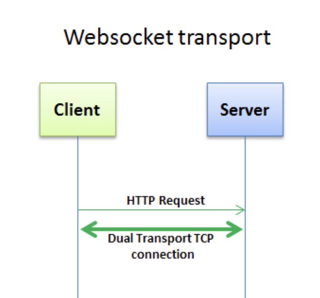
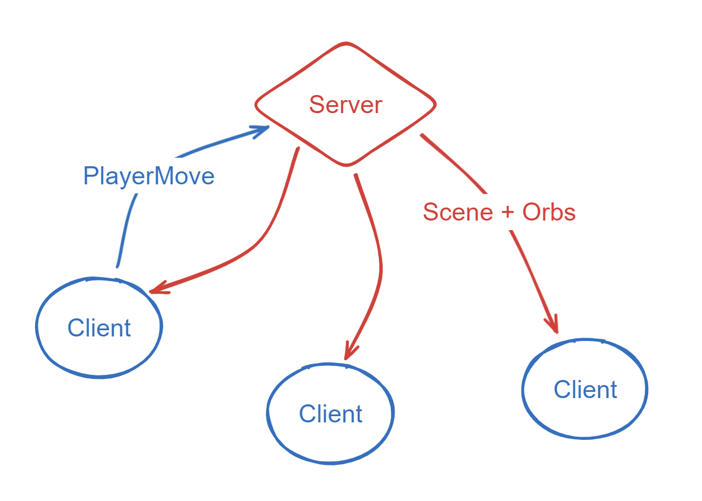

<h1 align="center">🎮 Slither.io clone</h1>
<h4 align="center">Mael KERICHARD - Cody ADAM</h4>
<p align="center">
   
   
</p>


# Communication Client - Server

## Websocket



## Data transfer



**Server -> Client**:
```ts
type SceneDTO = {
    width: number;
    height: number;
    players: {
        body: {
            x: number;
            y: number;
        }[];
        id: string;
        name: string;
        color: string;
        score: number;
        isSprinting: boolean;
    }[];
};

type OrbDTO = {
    points: number;
    color: string;
    id: string;
    position: {
        x: number;
        y: number;
    };
}

type ScoresDTO = {
    name: string;
    score: number;
}[]
```

**Client -> Server**:
```ts
type PlayerMoveDTO = {
    angle: number;
    isSprinting: boolean;
}
```

# Chunking system


# 📁 Architecture

The project is divided into 4 packages (mono-repo architecture):

```
packages/
├── client
├── server
└── shared
└── load-test
```

# 😆 Usage

Play now at https://pixselve-school.github.io/SR-projet/ !

> You can use the deployed server url `sr.mael.app`.


If you want to run the server locally, you can use the following command:

```bash
# Install the dependencies
npm install

# Run the server, client and shared packages all at once
npm run dev

# Run the e2e tests for 50 players (requires the server to be running)
npm run test
```

For more information, see the README in each package.

- [Client](./packages/client/README.md)
- [Server](./packages/server/README.md)
- [Shared](./packages/shared/README.md)
- [Load Test](./packages/load-test/README.md)


# Project milestones

## MVP

- [x] Players are dots
- [x] Players collect dots to gain points
- [x] Move towards mouse
- [x] Client - Serverr architecture (Websocket)
- [x] Client sends inputs each frames
- [x] Server sends game state each frames

## Improvement 1

- [x] Player grow in length when collecting dots
- [x] Add a dash while pressing space bar
- [x] Dash consume poing (and length) drop orbs
- [x] Menu to choose a nickname and connect to the server
- [x] Option to change the server url
- [x] Center the camera on the player

## Improvement 2

- [x] Collision between players to kill them
- [x] Client side position interpolation
- [x] Death drop dots depending on your current score
- [x] Timemanager (client) to handle the game loop FPS / TPS

## Improvement 3

- [x] Add a leaderboard
- [x] Send leaderboard on a less frequent basis
- [x] Send to the client only the relevant informations
- [x] Dynamic player size depending on score

## Improvement 4

- [x] Make the game look good
- [x] Animation on sprinting 

## Improvement 5

- [x] Add chaos testing for e2e tests (also serve as bots)
- [x] Chunk for collision detection performance + smaller payload sent to the client
