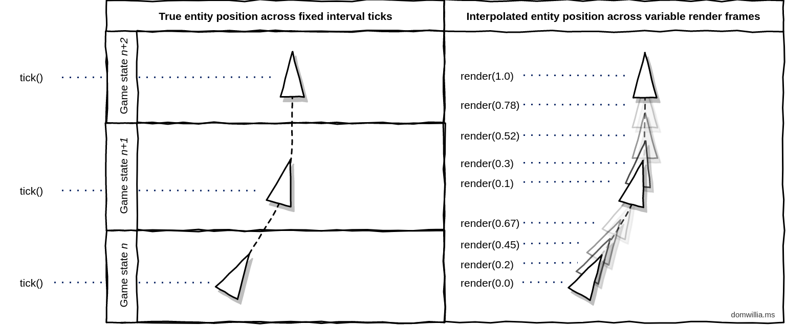
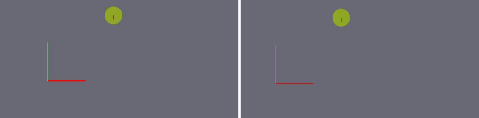

# My personal report on the SR project - Cody Adam

# Feedback

Me and Mael, we both enjoyed working on this project, the main factor is we had a lot of freedom and room for creativity. This is why we both spent a lot more time on this project than we initially planned.

# Our vision

When we started the project, we had a lot of game ideas, but we decided to go with a simple game to be able to finish the project in time. So this is why when on the path of recreating one of the .io popular multiplayer web games like agar.io or paper.io. We chose to go with slither.io because it was quite similar to the example snake game from the PDF.

# Our approach

At first we really focus thinking how would the communication between the server and the client would work. We decided to go with websockets because it was the most efficient way to communicate between the server and the client.

Then we planned a good roadmap of features to implement. Starting with the MVP and then adding more features to make the game more fun and interesting. [Check the Readme for the roadmap](../../README.md)

We are both well qualified in web development so this part was quite easy for us. We decided quite early to split the workload between the server and the client. Mael would work on the server and I would work on the client which would avoid us to step on each other's toes.

Before going directly to the implementation we made sure to set the shared DTOs (Data Transfer Objects) types that would be used by both the server and the client. This was a good idea because it allowed us to work in parallel without having to wait for the other to finish their part. ([packages/shared/src/types.ts](../../packages/shared/src/types.ts))

# My frontend

For the frontend here is the technologies I used and why:

- Next.js: just one of the best React Frameworks out there. It's easy to use and it's very powerful.
- React: My preferred library for building UIs.
- TypeScript: Because JS is 🤮
- Socket.io: A popular library for websockets. This is what we used to communicate between the server and the client.
- TailwindCSS: For the styling (css framework)

# Main Features I implemented

## Project Structure

client
  ├─ src
  │  ├─ app
  │  │  ├─ apple-icon.png
  │  │  ├─ canvas.tsx
  │  │  ├─ favicon.ico
  │  │  ├─ icon.png
  │  │  ├─ opengraph-image.png
  │  │  └─ page.tsx
  │  ├─ assets
  │  │  ├─ background.png
  │  │  └─ logo.png
  │  ├─ env.js
  │  ├─ hooks
  │  │  ├─ useApi.ts
  │  │  ├─ useGame.ts
  │  │  ├─ useMouse.ts
  │  │  └─ useScreen.ts
  │  ├─ lib
  │  │  ├─ Entity.ts
  │  │  ├─ Game.ts
  │  │  ├─ MyPlayer.ts
  │  │  ├─ Orb.ts
  │  │  ├─ Player.ts
  │  │  ├─ shared-state.tsx
  │  │  └─ TimeManager.ts
  │  ├─ styles
  │  │  └─ globals.css
  │  └─ utils
  │     ├─ position.ts
  │     └─ random.ts
  ├─ tailwind.config.ts
  └─ tsconfig.json

## Setup the front-end and GUI

For the GUI, it's quite simple, we have 2 pages:
- Login page: Ask for a username and a server url
- Game page: The game wich use an HTML canvas to render the game

## Communication setup

For the communication between the server and the client we used websockets.
Why is that? Because websockets are the most efficient way to communicate bidirectionally and frequently between the server and the client.
For this we used the popular library `socket.io`.

Using websocket on client-side is quite simple, here is a **simplified** overview of how we use it:

- First we connect to the server
- Then we listen to the events we want to receive from the server
  - Listen to `SCORES` event -> update the scores
  - Listen to `ORBS` event -> update the orbs
  - Listen to `SCENE` event -> update the scene (all visible players)
- And we emit the events we want to send to the server
  - At a fixed rate we send our inputs to the server, Emit `PLAYER MOVE` event

For the source see : [packages/client/src/hooks/useApi.ts](../../packages/client/src/hooks/useApi.ts)

## Time management and game loop

## Client side interpolation

Because we splitted the update from the fixed update we can get a high frame rate on the client side.
The problem is that it's the server that sends the updates position of the players. That means that even with a high frame rate, the player will still see the other players moving in a choppy way.

To counter that we can use interpolation to smooth the position of objects when they move.

> From https://domwillia.ms/devlog1/
>
> 
>
> Before and after :
>
> 
>
> On the left we observe a wandering entity with no interpolation (sad), with a jiggle or two of stuttery camera movement. On the right is the same scene but rendered at 60fps with interpolation.

I implemented this same system to get the smoothness of the movement of the players and the camera even if the TPS is low.

